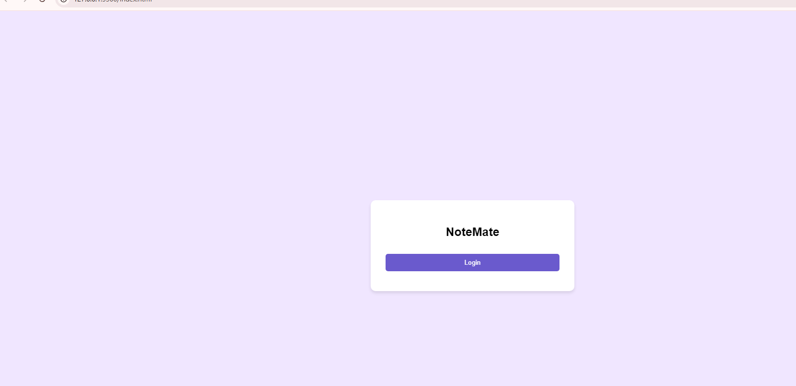
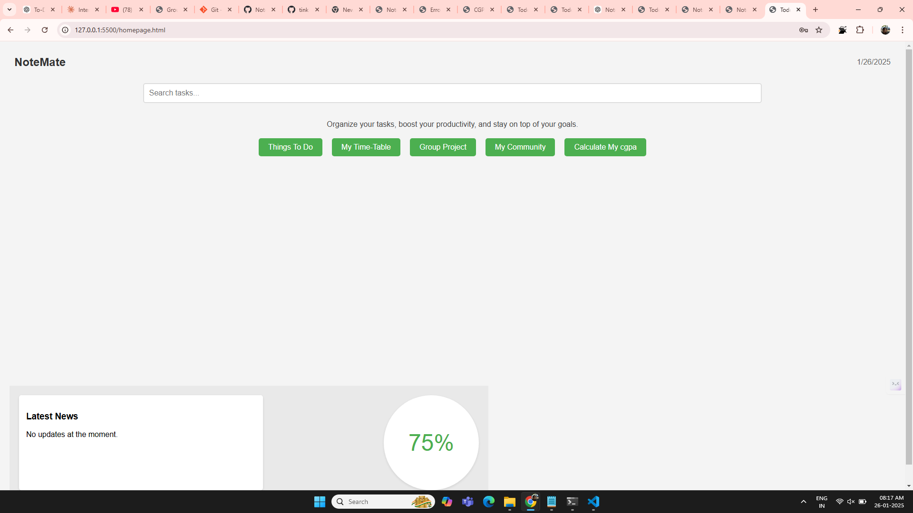
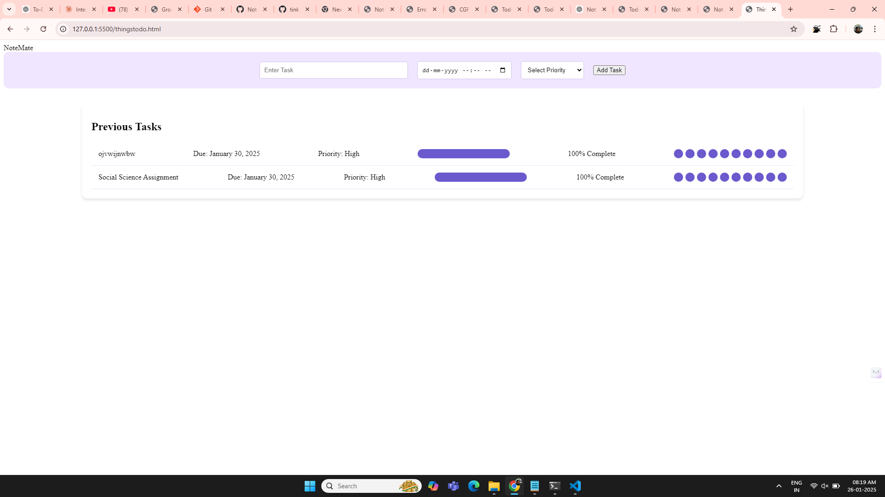
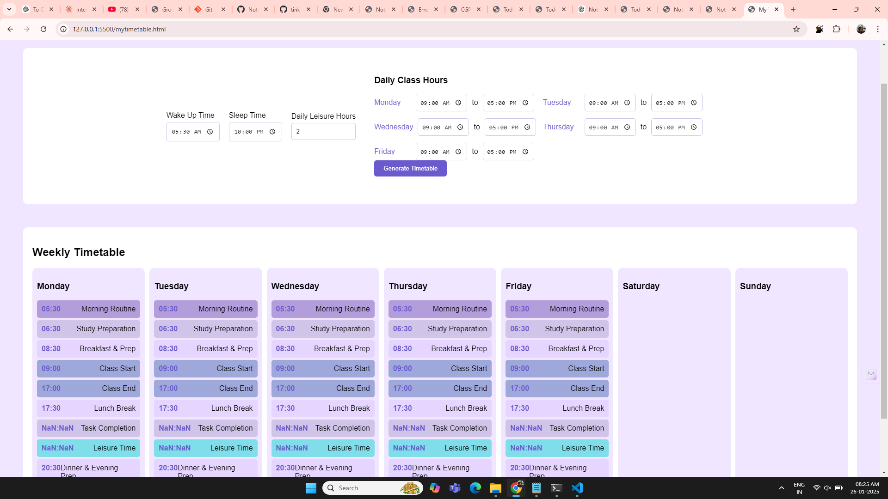
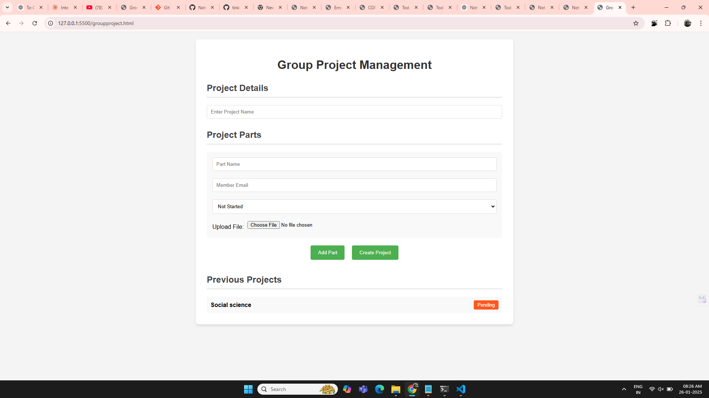
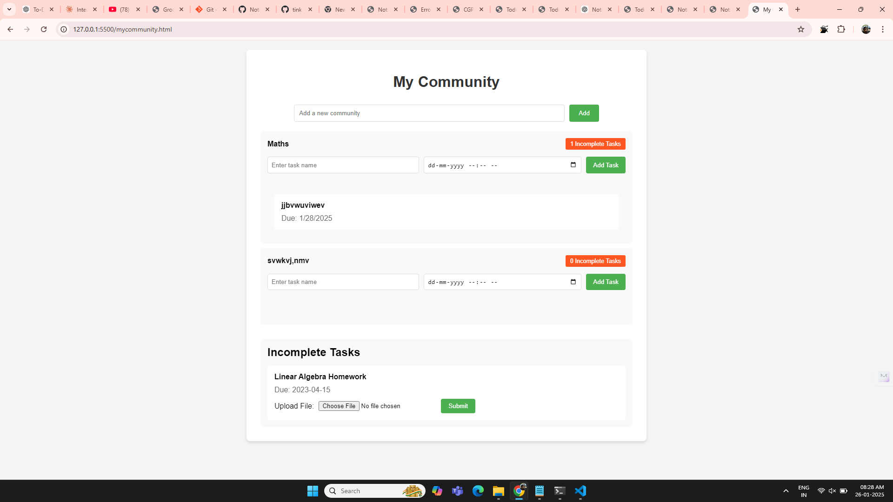
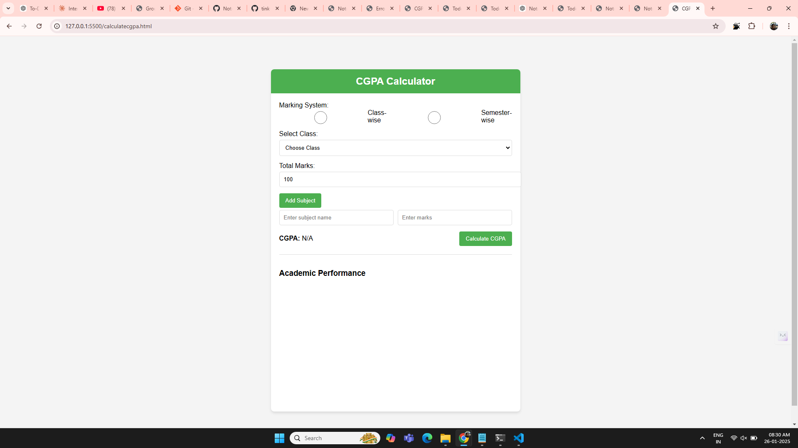

# NoteMate 🎯

## Basic Details
### Team Name: Powerpuff Girlss

### Team Members
- Member 1: Dhiya A Shiju - SCMS Cochin School of Business
- Member 2: Irfana Nasar- SCMS Cochin School of Business
- Member 3: Riya Martin- SCMS Cochin of Business

### Hosted Project Link
(https://github.com/dhiyashiju/NoteMate/tree/master)

### Project Description
Notemate is a productivity app designed to optimize time management with personalized timetables, collaborative project task assignment, community-based assignment sharing, and academic performance tracking through CGPA calculation and visualized progress graphs.

### The Problem statement
Before NoteMate, students and professionals often struggled with chaotic schedules, missed deadlines, and ineffective time management. Group projects turned into a mess of miscommunication and uneven task distribution, while academic tracking felt cumbersome with manual CGPA calculations and unclear performance insights. Assignments shared in communities relied on scattered platforms, leading to confusion and delayed submissions. NoteMate solves these issues by offering an all-in-one solution: personalized timetables, streamlined project collaboration, seamless assignment updates, and automated CGPA calculation with performance graphs—all in one app. It transforms productivity from a challenge into a seamless experience.

### The Solution
The chaos was real. Students were drowning in sticky notes, missed deadlines, and that one friend in every group project who vanishes faster than free pizza. Teachers? They were tired of yelling, "Check your email!" only for assignments to disappear into a black hole of unread messages. And don’t even get us started on calculating CGPAs—it was basically rocket science with fewer calculators and more tears.  

Enter NoteMate, our superhero in app form. We gave your sticky notes a retirement plan, turned group projects into team efforts (even that disappearing friend had nowhere to hide), and made sure assignments landed directly where they belonged—no more "I didn’t get the memo" excuses. And for the math-challenged, we took CGPA calculations from "huh?" to "oh wow, look at my graph!" in seconds.  

NoteMate didn’t just organize productivity; it saved friendships, lowered caffeine dependency, and made time management almost...fun. You're welcome, world.

## Technical Details
### Technologies/Components Used
For Software:
- HTML,CSS,JavaScript

- Visual Studio,GitHub

### Implementation
For Software:
# Installation
[commands]

# Run
Nil

### Project Documentation
For Software:

# Screenshots (Add at least 3)
](Add screenshot 1 here with proper name)
*The image shows the first page of the website - the login, wherein you can login and you will be guided to a signup or login page*

](Add screenshot 2 here with proper name)
*The image shows the home page of the website, where in the bottom left corner there's a news board for daily news updates and on the bottom right corner, there's a productivity index score displayed of the user depending on how effectively the user completes the tasks. And several buttons in the middle, clicking upon which you will be lead to various pages.*

](Add screenshot 3 here with proper name)
*The image shows the things to do page, where you can add your tasks and give the deadline and assign the priority level as well, each bubble against the task marks 10% of progress, by clicking each bubble you can mark your progress regarding the task*

](Add screenshot 3 here with proper name)
*The image shows the timetable page where you can give your schedule like waking up time, sleeping time, your daily class hours and the leisure time you require to indulge in hobbies, depending on these inputs the website will create a timetable for you, creating time for you to finish your tasks accordingly*

](Add screenshot 3 here with proper name)
*The image shows the group project page where the user can divide their assigned group project into parts like introduction, research, conclusion etc then assign each part to their group members by mentioning their email id below and the group members can update their status on the project as well and also upload their parts as a separate file*

](Add screenshot 3 here with proper name)
*The image shows the my community page where you can add the name of your subjects as your communities, the teacher can put assignments or projects and their deadline, you can also upload your final assignments in here and the teacher can access it, it will also show the number of incomplete tasks in each community*

](Add screenshot 3 here with proper name)
*The image shows the calculate my cgpa page where you can either use class-wise or semester wise option depending on whether you are a school or college student, then put down the names of the subjects after selecting your class or semester, then put the marks also mention the total marks, the website will calculate your cgpa and and also show an academic graph of your performance*

# Diagrams

*Add caption explaining your workflow*

For Hardware:

# Schematic & Circuit

*Add caption explaining connections*

*Add caption explaining the schematic*

# Build Photos

*List out all components shown*

*Explain the build steps*

*Explain the final build*

### Project Demo
# Video
[Add your demo video link here]
*Explain what the video demonstrates*

# Additional Demos
[Add any extra demo materials/links]

## Team Contributions
- [Dhiya A Shiju]: [HTML Coding]
- [Irfana Nasar]: [CSS Coding]
- [Riya Martin]: [Javascript]

---
Made with ❤️ at TinkerHub